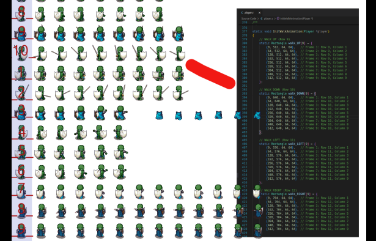

# Animated FSM Command Pattern StarterKit Guide 

<a name="animated-fsm-command-pattern-starterkit-guide"></a>

## Overview <a name="overview"></a>

This _StarterKit_ is a [Raylib](https://www.raylib.com/) framework for implementing a [**Animated Finite State Machine (FSM)**](https://www.codeproject.com/articles/State-Machine-Design-in-C#comments-section) in C using Raylib. It combines state management, command-based input, [collision detection](https://github.com/RandyGaul/cute_headers/blob/master/cute_c2.h), sprite-based animations, and a mediator system to create dynamic player and NPC behaviours. The _StarterKit_ is designed for learning core game development patterns such as event handling, state transitions, animated sprites, and game object management.

The project is organised into modular source and header files, along with a `Makefile` for easy compilation and deployment on desktop.

_StarterKit_ provides a framework for game development featuring:

- Finite State Machine (FSM) for entity behaviour management  
- Command pattern for input and action handling via Mediator 
- Sprite-based animation system  
- Flexible state transition validation  
- Basic collision detection  
- Decoupled game object interactions  

## Table of Contents

- [Overview](#overview)
- [Quick Start](#quick-start)
- [Architecture](#architecture)
    - [System Flow](#system-flow)
    - [Command Flow](#command-flow)
    - [Control Flow](#control-flow)
- [Project Structure](#project-structure)
- [Core Systems](#core-systems)
    - [Finite State Machine (FSM)](#finite-state-machine-fsm)
    - [Event System](#event-system)
    - [Command Pattern](#command-pattern)
    - [Animation System](#animation-system)
    - [Collision Detection](#collision-detection)
    - [GameObject](#gameobject)
    - [Input System](#input-system)
- [Animation Sprite Sheets](#spritesheets)
- [Tasks](#tasks)
- [Resources](#resources)
- [Support](#support)

## Quick Start 

<a name="quick-start"></a>

### 1. Clone the Repository

```bash
git clone https://MuddyGames@bitbucket.org/MuddyGames/raylib_animated_fsm.git raylib_animated_fsm_project
cd raylib_animated_fsm_project
```

### 2. Install Toolchain

```bash
make toolchain
```

### 3. Build and Run

```bash
make build
make run
```

### 4. Clean Build

```bash
make clean
```

## Architecture 

<a name="architecture"></a>

_StarterKit_ is composed of several design patterns and systems:

### Game System Flow

<a name="system-flow"></a>

[](https://mermaid.live/edit#pako:eNpVkltv4jAQhf-KNSv1KUW5EkillSABygO7ldinTfrgJWNIFdvIcdqmiP--zqVtyIPlOd85M5YyFzjIHCECVsq3w4kqTf4kmSDmW6Rbca412VFBj6ieyf39T7JMd5gXVEv13LuWnRynseScipzcvaLSD2T1ikKTwRN3niRd73eDknTKKl2IglNdSEH2TaWR3-B1uqEcye9_L3jQ1YDWHdqkTyVtUN2Ij-mvp3hQNp2yNc8qy6JqBySoTRtzGxyPvaMvtv0L-6I_K92USBaEFWUZ_UCHBYyNyXIgjDEfnTGJvzPsliRfmbbfmKw-SdCmxmT9Pce-7bYddUMHLOCoOC1y8zcvrS8DfUKOGUTmmiOjdakzyMTVWGmt5b4RB4i0qtECJevjCSJGy8pU9TmnGpOCHhXlX-qZir9S8s_IUbWjhjiKHFUsa6EhcsPOC9EF3iHyfG_ihkHoTj1n5gVz34IGIsefzD3bnob21PXCcO5dLfjomtuTaRD6MzeYOa5jh044t8CsnNm4Xb-p3cJe_wNNUc_m)

**Description:**

1. **Input Manager** captures keyboard/gamepad input
2. **Mediator** receives raw input and coordinates between systems (FSM / GameLoop / EVENTS)
3. **Command System** translates input into game commands
4. **FSM** processes commands and manages state transitions
5. **Animation System** syncronises animations with current FSM state
6. **Game Objects** (Player/NPC) execute state behaviours
7. **Collision Detection** checks for interactions and sends events to FSM

### Command Flow

<a name="command-flow"></a>

[](https://mermaid.live/edit#pako:eNptk21v2jAQx7-K5VetlFICgTxoQqpSylCVUS10Lyak6UiuIVNiZ47TljG--84JdCCWF_HD_3d3-p_tHU9kijzgNf5qUCR4n0OmoFwJRl8FSudJXoHQbB4xqNlcVI1mEQjIUF1CLRNhmoOW_5HD2OihLEsQ6aX8ELfxNFxqs4WRZlDiYv0TE90R3X8e3Uwm8yhgT7Io2CNu1xJUemvgCtIThpCv8HYwcQ8aOs1IYUzhSiZYH0x2UhgftKUCURegkWl5dMAeCsjqT2t1O7mKFt-mP56f2B92t1zehY_XJ_FU9syzqUcmAzZ9x6ShlGcqKUc9bJRCMh9rU_gzIQVOX2nn6vqUnS0C9lylhvnXoC6ow2aLY8YuU7gBkWF62sMvkvblKyrqlGUSnp00u5l8HKuZHxtAU3NoNJjCrKtcc4uXqErIU7pYO5N_xfUGS1zxgKYpvkBT6BVfiT2h0GgZb0XCA60atLiSTbbhwQsUNa2a1tfhVn7s0pX4LmV5DMmUKXUIR5GiCmUjNA_svt_CPNjxd1p6fs8e-bbtjUeDoTN0Rxbf8sAb9lzH9R137A8817b3Fv_dZu_33PHItgejodd3fGIci1MXqAlR92rax7P_Czt8BME)

**Command Flow Description:**

1. **Input Manager** polls keyboard/gamepad for raw input (also AI Input Manager selects NPC's input)
2. **Mediator** receives and coordinates input data
3. **Command System** translates input into bitwise command flags processed by Mediator and sent to FSM
4. **FSM** calls HandleEvent() on current state
5. **GameObject** state is updated based on command

### Control Flow (Game Loop)

<a name="control-flow"></a>

[](https://mermaid.live/edit#pako:eNqdlV1vmzAUhv8KclSpk5IKEkKASpsI2Emar2ntNm2kF25wEjawIzBruzT_fcZAirJdjHKBbM77vOdwbPABrFlAgA02EXtc73DClTtvRVdUEdfFhdLpdBQ0W35VLtcs3uM1VyL8QKL0XR4pVLdcUJf-CMdEmTG2Lx7c54r3iuN_ZFE0ofuMt3T1uqVr1_cF5si4689JEGLOkjGmQURcFsdikGtPwxPiSsTzRQJOlAKAvwiV1vALXNzVxJ4Uw0MhvkswTUMeMvrhWMSLO8xVL99I-qIgHz6F0koiNSskrUY-pJwk_xKMpGDsf94HIlBG_5YVyRbsRRnXaxhLelLSDg1jnBeaO-RNXT78IGtes5lI_Vx21pmctXUugzelmeIKTRiQJD2TFfcbKZ4epCqtNWf62paZX61MqTlzmkmPhe8l-DEv9yw8Pb3zotpWC0ksD58ySkO6rXIuX3PKHVR_mvOQBvVdJqb37yrLlD9HpMCUTRhFdstSIbTUdsoT9pPYrZ6uW31YTjuPYcB3trZ_qtPCsGQRGhqu0Yg9kVAf9puQ0zeTyzeTTkl6BnSQ2YR0SxIOUR8Nm5BeRZqeA1ETElXv6XhDr1G1o4p0Uc9tlHNckRBZcNCEnFRkF-lIb0LOq1XRIfIaVXtT5fSgB90m5Oy1twOn0deyOO0hsSr_US1og5gkMQ4DcdgccqcV4DsSkxWwxTAgG5xFfAVW9CikOOPs9pmugc2TjLRBwrLtDtgbHKVilsl_mxfibYLjSrLH9Dtjp-k2yTOVNKHiF-iyjHJga31DioF9AE_A7g7MK3NgGj2tb2kDy7Da4BnYna5qXamappuWaZiaoavGsQ1-S3_tSld7mtrtWwIyu1av3wbiDBNH2Lw4SuWJevwDFQ0-7g)

**Control Flow Description (Per Frame):**

1. **PollInput()**: Capture keyboard/gamepad state
2. **MediatorHandleCommand()**: Mediator coordinates input data
3. **Translate to Events**: Convert commands to events
4. **Current State HandleEvent()**: Process events in current FSM state
5. **State Transition Check**: ChangeState() determines if state change is needed
6. **Exit()**: Call Exit() function when leaving current state
7. **Entry()**: Call Entry() function when entering new state
8. **Update()**: Call Update() function for current state
9. **UpdateAnimation()**: Advance animation frame based on deltaTime
10. **PollAI()**: NPC decision-making and state management
11. **Update Colliders**: Sync collision circles with GameObject positions
12. **Collision Detection**: Check for overlaps between objects
13. **Handle Collision Event**: Process collision events if detected
14. **DrawFrame()**: Render all GameObjects and UI
15. **Game Running Check**: Continue if game is running, otherwise exit

### Key Components

1. **Finite State Machine (FSM)**: State-based behaviour management for game objects
2. **Command Pattern**: Decoupled input handling with support for diagonal movement
3. **Animation System**: Sprite-based frame animations synchronised with FSM states
4. **Collision Detection**: Circle-based collision using cute_c2 library
5. **Mediator Pattern**: Decoupled communication between systems
6. **Event System**: Event-driven state transitions
7. **Cross-Platform Support**: Desktop (Windows/Linux/MacOS)


## Project Structure 

<a name="project-structure"></a>

```
raylib_animated_fsm/
├── bin/                    # Compiled binaries (output)
├── include/                # Header files
│   ├── animation/
│   │   └── animation.h     # Animation system definitions
│   ├── command/
│   │   └── command.h       # Command structures and enums
│   ├── events/
│   │   └── events.h        # Event type definitions
│   ├── fsm/
│   │   └── fsm.h           # FSM logic and state management
│   ├── game/
│   │   └── game.h          # Game loop and system integration
│   ├── gameobjects/
│   │   ├── gameobject.h    # Base GameObject structure
│   │   ├── player.h        # Player-specific logic
│   │   └── npc.h           # NPC-specific logic
│   └── utils/
│       ├── ai_manager.h    # AI input handling for NPCs
│       ├── collision.h     # Collision detection wrapper
│       ├── constants.h     # Shared constants
│       ├── cute_c2.h       # cute_c2 collision library
│       ├── input_manager.h # Input handling system
│       └── mediator.h      # Mediator pattern interface
├── src/                    # Source files
│   ├── ai_manager.c        # AI decision making
│   ├── animation.c         # Animation system implementation
│   ├── collision.c         # Collision system wrapper
│   ├── command.c           # Command implementations
│   ├── cute_c2_impl.c      # cute_c2 implementation helper
│   ├── fsm.c               # FSM logic implementation
│   ├── game.c              # Game system implementation
│   ├── gameobject.c        # GameObject base implementation
│   ├── input_manager.c     # Input system implementation
│   ├── main.c              # Entry point
│   ├── mediator.c          # Mediator implementation
│   ├── npc.c               # NPC behaviours
│   └── player.c            # Player behaviours
├── resources/              # Sprite sheets and assets
├── Makefile                # Build configuration
└── README.md               # This file
```

## Core Systems

### 1. Finite State Machine (FSM)

<a name="finite-state-machine-fsm"></a>

The FSM manages object behaviour through states and transitions, now synchronised with sprite animations.

**Available States:**

- `STATE_IDLE`: Character **IDLE** (Idle animation)
- `STATE_WALKING`: Character **MOVING** (Walking animation)
- `STATE_ATTACKING`: Character **ATTACKING** (Attack animation)

Please note other States are available but have not been fully implemented. Examples include:

- `STATE_SHIELD`: Character **DEFENDING** (Shield animation)
- `STATE_DEAD` : Character **DEAD** (Death animation)
- `STATE_RESPAWN` : Character **RESPAWNING** (Respawn animation)

**State Configuration:**

Each state has the following 'protocols' (**function pointers**):

- **Entry**: Called once when entering the **STATE**  (performs tasks such as setting up animation atlas)
- **Update**: Called every frame while in the **STATE**  (updates animation and updates GameObject variables)
- **Exit**: Called once when leaving the **STATE**  (Resets GameObject variables if required)

**Example State Setup:**

```c
// ---- STATE_IDLE state configuration ----
// Define valid transitions from STATE_IDLE
EventStateTransition idleValidTransitions[] = {
	// EVENT -> STATE
	{EVENT_MOVE, STATE_WALKING},
	{EVENT_ATTACK, STATE_ATTACKING},
	{EVENT_DEFEND, STATE_SHIELD},
	{EVENT_DIE, STATE_DEAD}};

// Set up the state configuration for STATE_IDLE
InitStateConfig(object, STATE_IDLE, "Player_Idle", PlayerEnterIdle, PlayerUpdateIdle, PlayerExitIdle);

// Configure valid transitions for STATE_IDLE
StateTransitions(&object->stateConfigs[STATE_IDLE], idleValidTransitions, sizeof(idleValidTransitions) / sizeof(EventStateTransition));
```

**FSM State Diagram:**

[](https://mermaid.live/edit#pako:eNqNlF1vgjAUhv8KOZcLGhFB7MUSAt1GhrAI0WRjMY1UJRFqsCzbjP99-AU6VOSKHp6np-dNyhomLKSAYMUJp2ZEZimJG1_tIBHy5-PhU2g0HgXP1308tkwb7-vl-uTzSLdfLedZQAIeYscf993hLVz3fd04E_aVG4r3YmHbLHgTP2HHvMGbWD-hrcNpToXjmc-HLBzHdfBt_J4pqlbtIFXl8izXaMO1bcuzXKdQiso4JwZ-NYpykkoYehLFhEcsEQwWLxeU0zqxPvlDBHcGX6HrG5QRXOlRJvIv_Etmfb8dUQoD7L3pozL_w_rUOCJ35A0ixDSNSRTmV3W93SQAPqcxDQDlryGdkmzBAwiSTY6SjDPvJ5kA4mlGRUhZNpsDmpLFKl9ly7C86kV1SZJ3xuKjMku3rQ46TUKaGixLOCBJ3rGA1vANSFOaSrunqVJHaUk9RZZE-AHUkZuS2lW7eU2TpZaibET43W3eamqSrEptVZU1Re51NUUEGkacpf39b2j3N9r8Ab3WRuc)

### 2. Event System

<a name="event-system"></a>

Events trigger state transitions and are integrated with the animation system:

```c
typedef enum
{
    EVENT_NONE,             // No action Idle Animation
    EVENT_MOVE,             // Movement input (triggers Walk animation)
    EVENT_ATTACK,           // Attack action (triggers Attack animation)
    EVENT_DEFEND,           // Shield action (triggers Shield animation)
    EVENT_DIE,              // Death condition (triggers Death animation)
    EVENT_RESPAWN,          // Respawn trigger (triggers Respawn animation)
    EVENT_COLLISION_START,  // Collision begins
    EVENT_COLLISION_END,    // Collision ends
    EVENT_COUNT             // Total event count
} Event;
```

### 3. Command

<a name="command-pattern"></a>

Command system supports Directional Movement and other Input Commands with bitwise flags:

**Command Flags:**

```c
// Define the Command enum
typedef enum
{
	NONE 				= 0,		// No command (used to represent idle state)
	MOVE_UP 			= 1 << 0,	// Binary: 000001 Command to move up
	MOVE_DOWN 			= 1 << 1,	// Binary: 000010 Command to move down
	MOVE_LEFT 			= 1 << 2,	// Binary: 000100 Command to move left
	MOVE_RIGHT 			= 1 << 3,	// Binary: 001000 Command to move right
	ATTACK				= 1 << 4,	// Binary: 010000 Command to perform an attack action (e.g., slash with sword)
	DEFEND				= 1 << 5,	// Binary: 100000 Command to perform an defend action (e.g., defend with sheild)
	COMMAND_COUNT 		= 6			// Total number of commands, useful for looping or limits
} Command;
```

### 4. Animation System

<a name="animation-system"></a>

The animation system provides sprite-based animations synchronised with FSM states.

**Animation Structure:**

```c
typedef struct AnimationData
{
    Texture2D texture;       // Sprite sheet texture
    Rectangle *frames;       // Array of frame rectangles
    int frameCount;          // Total number of frames
    int currentFrame;        // Current frame index
    float frameDuration;     // Duration per frame (seconds)
    float frameTimer;        // Timer for frame updates
    bool active;             // Animation active status
    bool loop;               // Looping behaviour
} AnimationData;
```

**Key Features:**

- Sprite sheet support with configurable frame rectangles (animation atlas)
- Frame-based timing system
- Looping and non-looping animations
- Automatic synchronisation with FSM states
- Support for different frame durations

**Animation Integration:**

```c
// Initialize animation for a state
InitAnimation(&player->animations[STATE_WALKING], 
              texture, frames, frameCount, 0.1f, true);

// Update animation (called in state Update function)
UpdateAnimation(&player->animations[player->base.currentState], deltaTime);

// Draw animation
DrawAnimation(&player->animations[player->base.currentState], 
              player->base.x, player->base.y);
```

### 5. Collision Detection

<a name="collision-detection"></a>

Circle-based collision using [cute_c2](https://github.com/RandyGaul/cute_headers/blob/master/cute_c2.h) library:

**Collision Features:**

- Circle-to-circle collision detection
- Collision manifolds for collision response
- Collision events integrated with FSM
- Pushback / Separation response
- Health / Damage on collision

**Collision Flow:**

```c
// Update colliders position (Sync Game World Draw Space and Collision Space)
player->base.collider.p.x = player->base.x;
player->base.collider.p.y = player->base.y;

// Check collision
bool isColliding = CheckCollision(&player->base, &npc->base);

// Handle collision states
if (isColliding && !player->base.isColliding) {
    HandleEvent(&player->base, EVENT_COLLISION_START, deltaTime);
    CollisionEntry(&player->base, &npc->base);
}
```

### 6. GameObject

<a name="gameobject"></a>

**GameObject Structure:**

```c
typedef struct GameObject
{
	const char *name;           // Object identifier

	// Positions and Transforms
	Vector2 position;			 // Gameobjects position in the game world
	Vector2 inputAxis;			 // Input Axis (WASD / Arrow Keys / D-Pad and Tumbstick)
	Direction currentDirection;	 // Used to face animations in correct direction
	Direction previousDirection; // Used to face animations in correct direction

	// Collision components
	c2Circle collider;	 // Circle collider used for collision detection
	c2Manifold manifold; // Manifold for finding incident normals
	bool isColliding;	 // Is Colliding

	// FSM
	StateConfig *stateConfigs; // Pointer to the array of state configurations for this game object
	State previousState;	   // The state the game object was previously in
	State currentState;		   // The current state of the game object

	// Animation
	AnimationData animation; // Player Animation
	Color color;			 // Gameobject's color, changes based on currentState
	Texture2D keyframes;	 // Sprite Sheet Texture

	// Gameplay Components
	int health;	 // The health of the game object
	float timer; // Can be used during updates

} GameObject;
```

**Player and NPC Entities:**

- **Player**: Controlled via keyboard/gamepad, with stamina and special abilities
- **NPC**: AI controlled NPC with simple AI behaviour

Both entities use the same FSM system and animation pipeline but have unique logic for handling events.

### 7. Input System

<a name="input-system"></a>

**Keyboard Mapping:**

- WASD / Arrow Keys: directional movement
- Space: Attack

**Input Processing:**

```c
Command PollInput() {
    Command command = NONE;
    
    // ...

    // Directional movement support
	if (IsKeyDown(KEY_W) || IsKeyDown(KEY_UP))
		command |= MOVE_UP;
	if (IsKeyDown(KEY_S) || IsKeyDown(KEY_DOWN))
		command |= MOVE_DOWN;
	if (IsKeyDown(KEY_A) || IsKeyDown(KEY_LEFT))
		command |= MOVE_LEFT;
	if (IsKeyDown(KEY_D) || IsKeyDown(KEY_RIGHT))
		command |= MOVE_RIGHT;
    // ... other directions
    
    if (IsKeyPressed(KEY_SPACE))
        command |= ATTACK;
    
    return command;
}
```

## Animation Sprite Sheets

<a name="spritesheets"></a>

Player and NPC Sprite Sheets are stored in the <a href="./assets/">./assets</a> folder. The <a href="./assets/production/">./production</a> folder contains <a href="./assets/production/grid_player_sprite_sheet.png">grid_player_sprite_sheet</a> with each of the animations laid out in a grid (to assist you in selecting the appropriate animation frames). On entry to a state the entry method sets up the animation atlas (coordinates) for that states animation. Example below if for `InitWalkAnimation`.

### Setting Up New Animations

Follow these steps to correctly extract animation frames from the sprite sheet and configure them in the game.

#### Step 1: Identify the Animation

Locate the correct animation row on the production grid (e.g. Walk Up, Idle, Attack, Death, etc.).

#### Step 2: Identify the Starting Position (x, y) for Frame 1

Each frame begins at the top-left corner of its grid (cell) on the sprite sheet.

- Most player and NPC animations use 64x64 sprites.
- Attack (Sword attack) animations use 192x192 sprites, which are exactly 3x3 grid cells (3 * 64x64 = 192x192) size.
- Frame sizes vary based on your chosen sprite sheet

> **Important:** All frames in a given animation must use the same width and height.
Example: Standard Walk Animation (64x64)


Example: Walk Up Animation (64x64)
```c
static Rectangle walk_UP[9] = {
    {0,   512, 64, 64},
    {64,  512, 64, 64},
    {128, 512, 64, 64},
    {192, 512, 64, 64},
    {256, 512, 64, 64},
    {320, 512, 64, 64},
    {384, 512, 64, 64},
    {448, 512, 64, 64},
    {512, 512, 64, 64}
};
```
Example: Sword Attack Animation (192x192)
```c
static Rectangle sword_ATTACK[6] = {
    {0,    1536, 192, 192},
    {192,  1536, 192, 192},
    {384,  1536, 192, 192},
    {576,  1536, 192, 192},
    {768,  1536, 192, 192},
    {960,  1536, 192, 192}
};
```

> **Note:** Since 192px = 3 x 64px, Attack (sword attack) frames advance by 192px increments along the x-axis (0, 192, 384, 576...) for the _StarterKit_ spritesheet.

Initialising an Animation

All animations are activated with:

```c
InitGameObjectAnimation(object, frameArray, frameCount, frameSpeed);
```

- `object`: Player, NPC, or any animated GameObject
- `frameArray`: The Rectangle array defining the animation frames
- `frameCount`: Number of frames in that array
- `frameSpeed`: Time between frames (lower = faster animation)

Complete Example:

```c
// Define the frame array
static Rectangle walk_UP[9] = {
    {0, 512, 64, 64},
    {64, 512, 64, 64},
    // ... remaining frames
};

// Initialise the animation
InitGameObjectAnimation(&player, walk_UP, 9, 0.055f);
```

Timing Guidelines:

| Animation Type           | Speed (float)     | Use Case                    |
| ------------------------ | ----------------- | --------------------------- |
| Walk / Run               | `0.05f - 0.07f`   | Character movement          |
| Attack / Sword           | `0.03f - 0.05f`   | Fast action animations      |
| Other Actions            | `0.08f - 0.12f`   | General purpose animations  |
| Subtle animations        | `0.10f - 0.20f`   | Idle, breathing, ambient    |

> **Tip:** Start with recommended ranges above and adjust based on testing and visual feedback (feel).

### Coordinate Calculation Rules

#### For 64x64 Animations:

- Column 0 starts at `x = 0`
- Row 0 starts at `y = 0`
- For 64x64 animations:
- **Formula:**
    - `x = column x 64` (e.g., column 3 -> x = 192)
	- `y = row x 64` (e.g., row 8 -> y = 512)

#### For 192x192 Sword Animations:

- **Formula:**
    - `x = column x 192` (e.g. column 2 -> x = 384)
	- `y = row x 192` (e.g. row 8 -> y = 1536)

> **Critical:** All frames in a single animation must have identical width and height, otherwise the sprite atlas will not render correctly.

### Naming Conventions

**Recommended patterns for frame arrays:**
```c
static Rectangle walk_UP[9];      // Direction-based movement
static Rectangle sword_ATTACK[6]; // Action-based animations
static Rectangle idle_DOWN[4];    // State-based animations
static Rectangle death_GENERIC[8];// Generic animations
```

>Use descriptive, UPPERCASE suffixes for clarity (this will help you when debugging).

### Pitfalls & Debugging
#### Animation Issues

- **Frame "jumps" or glitches:** The width / height is probably incorrect. Verify all frames use consistent dimensions.
- **Animation doesn't advance:** 
    - Confirm `frameCount` matches the actual number of frames in your array
	- Ensure the state's entry function calls `InitGameObjectAnimation`
- **Wrong frames display:** Double-check x and y offsets. Animation bugs can be caused by misaligned rectangles.

#### Large Sprite Handling (192x192)
When using large sprites like _sword attacks_:

- **Render offset:** Adjust the character's render offset so the sprite centers correctly on the character
- **Collider offset:** Verify collider offsets match the visual hitbox, not just the full sprite bounds
- **Visual drift:** Large sprites may appear to _"float"_ if offsets aren't properly configured

#### Verification Checklist
- [ ] All frames in the animation have identical width / height
- [ ] X-coordinate advances by the sprite width (64 or 192)
- [ ] Y-coordinate is consistent across all frames in the row
- [ ] `frameCount` parameter matches array length
- [ ] `frameSpeed` is within reasonable range (0.03f - 0.20f)

## Tasks

<a name="tasks"></a>

The following tasks are suggested to help with project implementation.

### Task 1: Implement Player Combat Actions

**Objective:** Create the three core player actions with animations and FSM integration.

1. **Add combat states to `fsm.h`:**
```c
STATE_SWORD_ATTACK,   // Plasma Sword attack
STATE_SHIELD_DEFEND,  // Energy Shield defense
STATE_MEGA_BLAST,    // Mega Blast special
```

2. **Implement state functions in `player.c`:**
```c
// Plasma Sword Attack
void PlayerEnterSword(GameObject *object, float deltaTime);
void PlayerUpdateSword(GameObject *object, float deltaTime);
void PlayerExitSword(GameObject *object, float deltaTime);

// Energy Shield Defense
void PlayerEnterShield(GameObject *object, float deltaTime);
void PlayerUpdateShield(GameObject *object, float deltaTime);
void PlayerExitShield(GameObject *object, float deltaTime);

// Mega Blast
void PlayerEnterMegaBlast(GameObject *object, float deltaTime);
void PlayerUpdateMegaBlast(GameObject *object, float deltaTime);
void PlayerExitMegaBlast(GameObject *object, float deltaTime);
```

3. **Configure animations for each action using the provided Alien/Robot sprite sheets**

4. **Add input commands to `input_manager.c`:**
```c
if (IsKeyPressed(KEY_S))
    command |= SWORD;
if (IsKeyPressed(KEY_D))
    command |= SHIELD;
if (IsKeyPressed(KEY_M))
    command |= MEGA;
```

### Task 2: Implement Enemy AI with FSM

**Objective:** Create strategic AI for the Alien NPC using Finite State Machine.

1. **Design Alien AI states in `npc.c`:**

   - `STATE_IDLE`: Waiting/observing player
   - `STATE_CHASE`: Moving toward player
   - `STATE_ATTACKING`: Executing attack
   - `STATE_DEFENDING`: Blocking/retreating
   - `STATE_DEAD`: Death state

2. **Implement AI decision-making in `ai_manager.c`:**

   - Distance-based state transitions
   - Health-based defensive behaviour
   - Attack pattern variations
   - Strategic timing for attacks

3. **Add state transition logic:**
```c
// Example: Transition based on distance to player
Vector2 npcPosition    = (Vector2){ npc->base.x, npc->base.y };
Vector2 playerPosition = (Vector2){ player->base.x, player->base.y };

float distanceToPlayer = Vector2Distance(npcPosition, playerPosition);

if (distanceToPlayer < ATTACK_RANGE)
{
    ChangeState(&npc->base, STATE_ATTACKING, deltaTime);
}
else if (distanceToPlayer < CHASE_RANGE)
{
    ChangeState(&npc->base, STATE_CHASE, deltaTime);
}

```

### Task 3: Implement Health and Collision System

**Objective:** Create a working health system with circle-based collision detection.

1. **Implement health bars for both Mech and Alien:**

   - Visual representation of current health
   - Health reduction on successful hits
   - Health regeneration for shield use (optional)

2. **Configure collision detection in `collision.c`:**
```c
// Check if attack hit enemy
if (player->base.currentState == STATE_ATTACKING) {
    bool hit = CheckCollision(&player->base, &npc->base);
    if (hit && !(npc->base.currentState == STATE_SHIELD)) {
        npc->health -= DAMAGE_DEFAULT;
        // Trigger hit animation/feedback
    }
}
```

3. **Implement collision response:**

   - Damage calculation based on attack type
   - Block detection for shield state
   - Knockback effects (for advanced implementations)

### Task 4: Add Visual and Audio Feedback

**Objective:** Provide clear feedback for player and NPC actions.

1. **Visual feedback (Options):**

   - Hit effects / particles on successful attacks
   - Shield glow during defense
   - Screen shake on heavy hits
   - Color changes on damage
   - Victory/defeat animations

2. **Audio feedback (Options):**

   - Sound effects for sword swings
   - Shield block sounds
   - Magic cast effects
   - Hit/damage sounds
   - Background music

### Task 5: Implement Combat Mode

**Objective:** Choose and implement either turn-based or real-time combat.

**Option A: Turn-Based Combat**

1. Implement turn system:

   - Player turn: Wait for input (S/D/M)
   - Execute player action with animation
   - Enemy turn: AI determines action
   - Execute enemy action with animation
   - Repeat until game over

2. Add turn indicators and UI

**Option B: Real-Time Melee Combat**

1. Implement continuous game loop:

   - Both player and NPC can act simultaneously
   - Add cooldowns for actions
   - Implement timing-based combat
   - Add dodge/movement mechanics

2. Balance action speeds and cooldowns

**MAKE SURE TO BUILD A STATE DIAGRAM e.g**

[](https://mermaid.live/edit#pako:eNqNlN9LwzAQx_-VkEdZX3zsgyCrysAp2IGg9SFrrm00P0qaTMbY_26SrjYb6zQP5XL55PK95K47XCoKOMWdIQYyRmpNRLK5LiRy4_3qAyXJDVpQDihFC8kMIxzlnu2J_hs2owci4Hn9CaVBu97vR9jrg7wS_sVk7eIs1QbQ3QakOYPdGkPKA9jbk2jeMODUcRlUIOkpN1rD0VEuTyrIEEc7Yu5vHTH9bylj2EjMIf5ciZaDATqFn1xhZrWf9cy5ww6qjtNeNRqIOQvFOc-VlQb0hei_75ABCakzuHRF09RxktNcpHQaGq3AePgFupZ8S8cP1smewR1d1OAa3qSH93HVS-WKXrO6MUhVUfVHgkNfrDSRnescJTsXThqtOAeK1tt0JBM0t1o7UXFz9QsLWSrhLyeI7uKl-3yJHlXNyt7pC8-LwjMsQAvCqGvs0IoFNo2r9QKnzqRQEctNgQu5dyixRuVbWeLUaAszrJWtG5xWhHduZls6_hgGpCXyTSlxgPY_DLtCBw)


## Resources <a name="resources"></a>

- [Raylib](https://www.raylib.com)
- [cute_headers](https://github.com/RandyGaul/cute_headers)
- [Game Programming Patterns](http://gameprogrammingpatterns.com)

## Support <a name="support"></a>

- Contact: muddygames

*This _StarterKit_ was created to help students understand game development patterns and create their own projects.*

[Back to top](#animated-fsm-command-pattern-starterkit-guide)